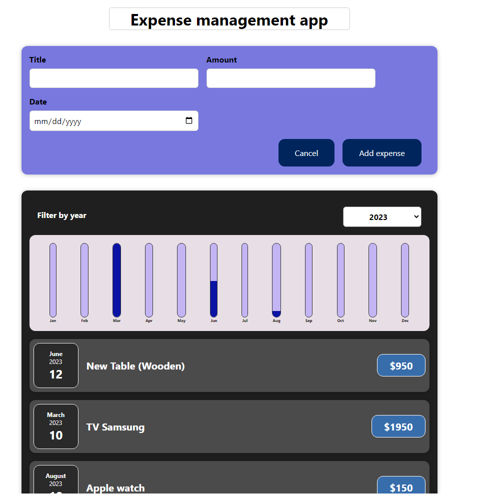

# reactjs-project


 A simple expense management dynamic web application using react.


## Getting started
Clone the repository and install some dependencies
```
git clone https://github.com/fermat01/reactjs-project.git
cd reactjs-project
npm install
npm start
```

Go to url 
```
http://localhost:3000

```





